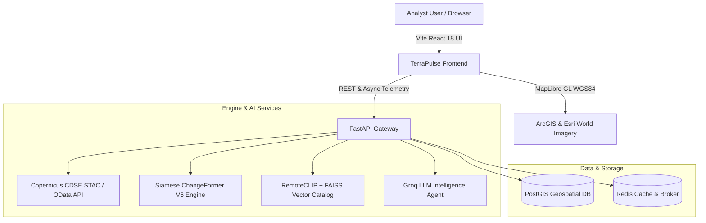

<div align="center">

# 🛰️ TerraPulse.AI
### Autonomous Geospatial Intelligence & Multi-Temporal Change Detection Platform
**Smart India Hackathon (SIH 2026) · Problem Statement: SIH 26227**

[](https://dataspace.copernicus.eu/)
[](https://fastapi.tiangolo.com/)
[](https://vitejs.dev/)
[](https://maplibre.org/)
[](https://github.com/facebookresearch/faiss)
[](LICENSE)

<br/>

> **Continuously monitor ground targets, detect infrastructure development, and analyze surface modifications using multispectral satellite passes and verified AI change intelligence.**

</div>

---

## 🌟 Executive Summary

**TerraPulse.AI** is an advanced, production-grade Earth Observation intelligence platform designed to eliminate false change alarms, uncover authentic terrestrial alterations, and enable plain-language semantic retrieval across satellite catalogs.

Addressing **SIH 26227**, TerraPulse combines **Copernicus Sentinel-2 multispectral passes**, **Siamese neural change detection (ChangeFormer)**, **RemoteCLIP multimodal embeddings**, and an **interactive AI geospatial intelligence agent** with full human-in-the-loop analyst certification.

---

## 🚀 Key Platform Capabilities

### 1. 🔭 Target Investigation & Split-Swipe Comparison
- **Interactive Swipe Slider**: Smoothly reveals baseline vs inspection satellite passes via real-time draggable divider.
- **Multispectral Band Switching**:
  - `True Color (RGB)`: Natural high-resolution surface photography.
  - `False Color NIR (Near-Infrared)`: Infrared channel displaying healthy vegetation in vivid crimson/red and urban development/excavation in cyan/grey.
  - `Night`: Nocturnal thermal surface contrast.
- **Comparison Layouts**: Supports `Swipe`, `Dual` (side-by-side), and `HD Inspector` modes.

### 2. 🤖 AI Geospatial Intelligence Agent
- Automated calculation of altered area in hectares (ha), sector percentage share, and confidence ratings (`HIGH CONFIDENCE 96.4%`).
- Mathematical spectral delta analysis: Normalized Difference Vegetation Index (**NDVI**) loss and surface **Albedo** displacement.
- **Interactive Conversational Q&A**: Analysts can ask plain-language questions (*"What changed here?"*, *"Where did construction occur?"*, *"Did water bodies shift?"*) and receive contextual reasoning grounded in sensor data.

### 3. 📡 Surveillance Overview (Mission Control)
- **Live User Geolocation**: Auto-detects device GPS with one-click *"Investigate Here"* routing.
- **Persistent AOI Monitoring**: Pre-configured strategic sectors (*Bhadla Solar Park, Mundra Port & SEZ, Korba Mining Complex, New Delhi Central, Pangong Corridor*).
- **Interactive MapLibre GL**: 2D Flat / 3D Oblique tilt controls, satellite hybrid basemap, live coordinate telemetry bar (`LAT`, `LNG`, `ZOOM`, `CRS: WGS84`).
- **Sentinel-2 Orbit Scheduler**: Real-time pass lookahead displaying upcoming orbits, sun elevation, and cloud probability.

### 4. 🧠 Semantic Natural-Language Earth Query
- Text-to-image semantic search powered by **RemoteCLIP** embeddings and **FAISS** vector indexing.
- Search satellite archives with prompts such as:
  - *"Show me open-pit excavation and earthmoving sites"*
  - *"Where did new structural construction occur?"*
  - *"Which areas changed the most across surveillance sectors?"*
- Spatial marker clustering and vector polygon footprint overlays.

### 5. 🛡️ Human-in-the-Loop Analyst Certification
- Rigorous verification loop allowing analysts to officially mark detections:
  - `Confirm Genuine Change` (verified ground alteration)
  - `Dismiss False Alarm` (benign seasonal or cloud shadow anomaly)
- **Export Intelligence**: One-click generation of certified intelligence audit reports in JSON and structured formats.

---

## 🏛️ System Architecture



---

## 🛠️ Technology Stack

| Domain | Technologies |
| :--- | :--- |
| **Frontend** | React 18, TypeScript, Vite, TailwindCSS, MapLibre GL, Framer Motion, Lucide Icons |
| **Backend API** | FastAPI, Python 3.10+, Uvicorn, Structlog, Pydantic V2 |
| **Earth Observation Data** | Copernicus Data Space Ecosystem (CDSE), Sentinel-2 L2A, Esri Wayback |
| **Geospatial Processing** | GDAL, Rasterio, Shapely, PyProj, GeoJSON |
| **AI / ML Models** | ChangeFormer (Transformer CD), RemoteCLIP ViT-L-14, FAISS Vector Index, Groq LLM |
| **Datastores** | PostgreSQL 16 + PostGIS, Redis 7 |

---

## ⚡ Quick Start Guide

### Prerequisites
- Node.js (v18+)
- Python (3.10+)
- Git

### 1. Clone Repository
```bash
git clone https://github.com/shravan-31/terrapulse-ai.git
cd terrapulse-ai
```

### 2. Frontend Setup & Launch
```bash
cd frontend
npm install
npm run dev
```
Open **`http://localhost:5173`** in your browser.

### 3. Backend Setup (Optional for Local API Server)
```bash
cd ../backend
python -m venv venv
# On Windows:
.\venv\Scripts\activate
# On Linux/macOS:
source venv/bin/activate

pip install -r requirements.txt
uvicorn app.main:app --host 0.0.0.0 --port 8000 --reload
```

---

## ☁️ Deployment Guide

### Deploy Frontend to Vercel
1. Log in to [vercel.com](https://vercel.com).
2. Click **"Add New..."** ➔ **"Project"** ➔ Import `shravan-31/terrapulse-ai`.
3. Set **Root Directory** to `frontend`.
4. Click **Deploy**. Vercel will automatically build the React application and deploy it with seamless client-side SPA routing (pre-configured via `vercel.json`).

---

## 👥 Authors & Acknowledgments

- **Team**: Developed for **Smart India Hackathon (SIH 2026)**
- **Problem Statement**: SIH 26227 — *Semantic Retrieval and Multi-Temporal Change Analysis of Satellite Imagery*
- **Imagery Acknowledgement**: Contains modified Copernicus Sentinel-2 data processed through Copernicus Data Space Ecosystem (CDSE) & Esri World Imagery.

---

<div align="center">
  <sub>Built with precision for sovereign Earth Observation intelligence.</sub>
</div>
