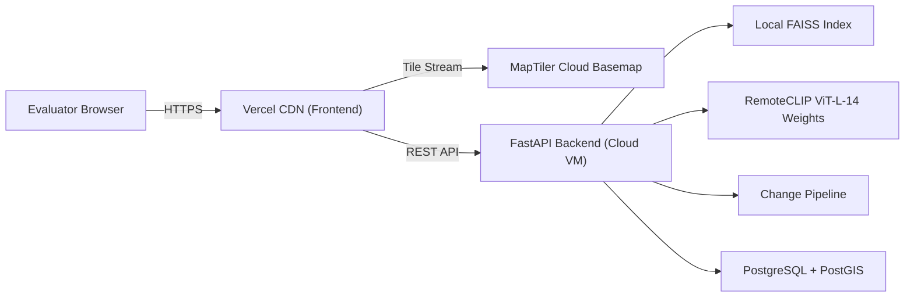
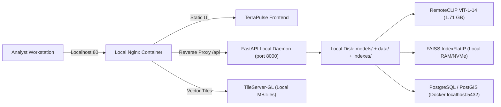

# TerraPulse AI — Dual Architecture Deployment Guide
**SIH Problem Statement 26227:** *Semantic Retrieval and Multi-Temporal Change Analysis of Satellite Imagery*  
**Standard:** Defense, Intelligence & Hackathon Dual-Operating Specification

TerraPulse AI supports two distinct deployment postures:
1. **Online Cloud Demo Mode** (Public evaluators, web accessibility, Vercel frontend)
2. **SIH Air-Gapped Mode** (Classified SCIF, field operations, zero external telemetry)

---

## Mode Comparison Matrix

| Operational Dimension | Online Cloud Demo Mode | SIH Air-Gapped Mode |
| :--- | :--- | :--- |
| **Primary Use Case** | Hackathon presentation, public portfolio, live judge evaluation | Military SCIF, sovereign defense facility, disconnected field lab |
| **Frontend Host** | Vercel Edge (`https://terrapulse-ai-gules.vercel.app/`) | Local Nginx or Vite container (`http://localhost:5173` or port 80) |
| **Backend API Host** | Cloud VM / Render / Railway (`https://api.terrapulse.ai`) | Local Docker container or systemd daemon (`http://localhost:8000`) |
| **Vector Index** | In-memory + persistent snapshot on cloud volume | Local FAISS `vector_index.faiss` mounted on local NVMe disk |
| **Foundation Model (RemoteCLIP)** | Local weights loaded in cloud container (1.71 GB) | `models/remoteclip/RemoteCLIP-ViT-L-14.pt` loaded directly on local GPU/CPU |
| **Change Detection Model** | Local fallback or trained weights container | Local ChangeFormer / calibrated fallback pipeline |
| **Satellite Basemaps** | MapTiler Cloud Vector/Raster Tiles (`api.maptiler.com`) | Local MBTiles server (TileServer-GL / Martin) or vector grid overlay |
| **Database** | Managed PostgreSQL 15 + PostGIS | Local PostgreSQL container (`db:5432`) or embedded SQLite fallback |
| **External Network Requirement** | Outbound HTTPS for MapTiler and web assets | **STRICTLY ZERO.** All network adapters can be physically disabled. |
| **DNS / Telemetry Dependency** | None (no telemetry trackers, no Google Analytics) | None |

---

## 1. Mode 1: Online Cloud Demo Mode

### Architecture Diagram


### Setup & Launch
```bash
# 1. Frontend
cd frontend
npm install
npm run build
# Deploy to Vercel via CLI or GitHub integration:
# vercel --prod

# 2. Backend
cd ../backend
uvicorn app.main:app --host 0.0.0.0 --port 8000
```

---

## 2. Mode 2: SIH Air-Gapped Mode

### Architecture Diagram


### Complete Air-Gapped Staging Procedure

1. **Verify Offline Assets Staged on Host Disk:**
   - Model weights: `models/remoteclip/RemoteCLIP-ViT-L-14.pt` (1.71 GB)
   - Change detection weights/pipeline: `models/changeformer/ChangeFormerV6.pth`
   - Datasets: `data/levir_cd/` and `data/oscd/` archives
   - Pre-computed FAISS index: `indexes/faiss/vector_index.faiss`
2. **Sever External Network:**
   ```powershell
   # Disable network interface on Windows host:
   Disable-NetAdapter -Name "Wi-Fi" -Confirm:$false
   # Or disconnect physical Ethernet cable
   ```
3. **Launch Offline Container Stack:**
   ```bash
   docker-compose up -d
   ```
4. **Access System:**
   Open browser to `http://localhost:5173`. Toggle the **"SIH OFFLINE MODE"** badge in Settings to activate offline telemetry.
5. **Verify Zero Network Outbound:**
   Open Developer Tools $\to$ Network tab. Perform text queries, image uploads, and change analyses. All HTTP transactions target `localhost` with zero DNS requests or outbound packets.
